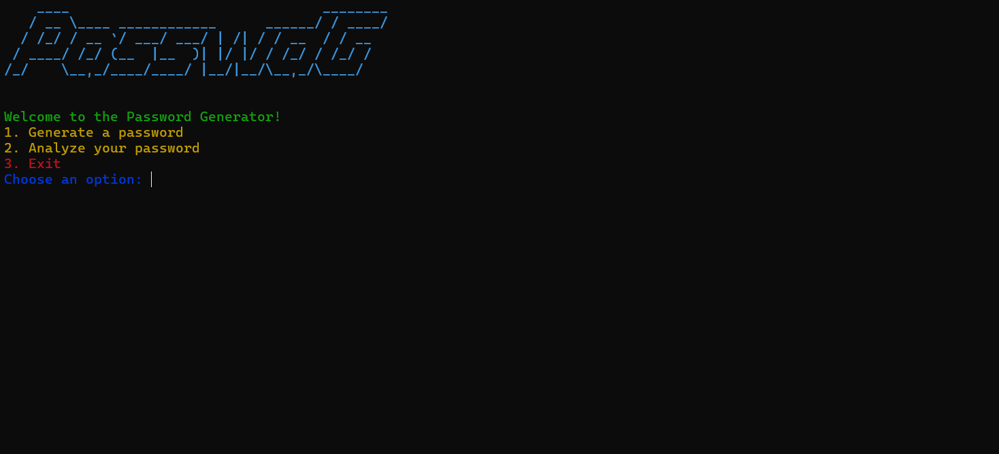

# Password Generator and Analyzer

**Password Generator and Analyzer** is a terminal-based Python application that allows users to:
- Generate strong, customizable passwords.
- Analyze the strength and security of any given password.
- Save generated passwords locally for reference.

## Features
- Password creation with customizable length and character sets (uppercase, lowercase, digits, special characters).
- Password strength analysis using [zxcvbn](https://github.com/dropbox/zxcvbn).
- Save passwords locally to a `passwords.txt` file.
- Evaluate the time required to crack a password (online/offline scenarios).

## Usage
### Requirements
- Python 3.8+
- Required libraries: See `requirements.txt`

### Installation
1. Clone the repository:
   ```bash
   git clone https://github.com/c4nng/PasswdG.git
   cd PasswdG

## Screenshots

### Main Menu


### Password Generator


### Password Analysis


